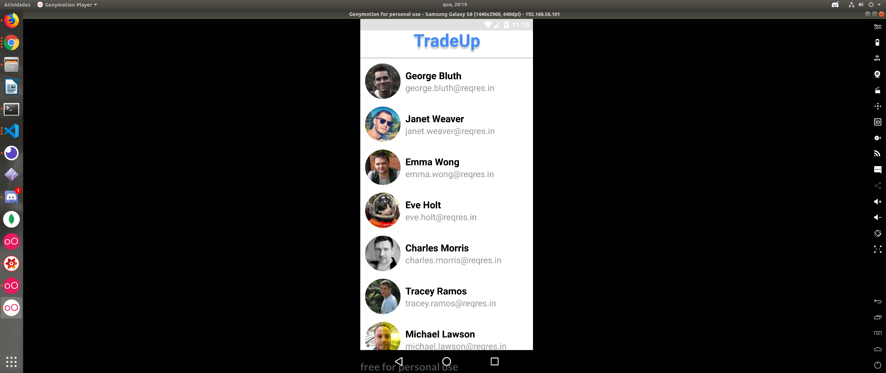

# TradeUp

Projeto simples, com login, lista de usuarios e detalhes de usuario.

- Infelizmente o projeto não pode ser testado no IOs.

# Testar a aplicação:

1. Ter o react-native-cli instalado globalmente, veja na [documentação](https://facebook.github.io/react-native/docs/getting-started):

   ```
    npm install -g react-native-cli
   ```

2. Ambiente de desenvolvimento React Native siga os passos [Docs.Rocketseat](https://docs.rocketseat.dev/ambiente-react-native/introducao)

1) Caso você já use o react-native e tenha o yarn instalado, basta fazer o clone do projeto e usar os seguintes comandos na pasta raiz do projeto.

   ```
     yarn react-native run-android
     yarn react-native start
   ```

3. Caso não tenha o yarn pode usar o npx.

# Layout base:


# Login


# UserList



# UserDetails


# Tecnologias Aplicadas

- [x] React Native;
- [x] Redux;
- [x] Redux Saga;
- [x] Redux Persist;
- [x] Styled Components;
- [x] Axios;

# Ferramentas Utilizadas

- [x] VScode;
- [x] Reactotron;
- [x] Genymotion;
- [x] Figma;
- [x] Ape Tools;
